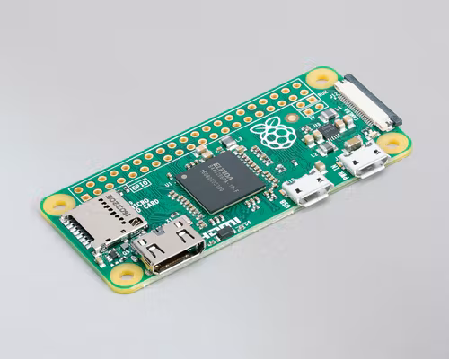
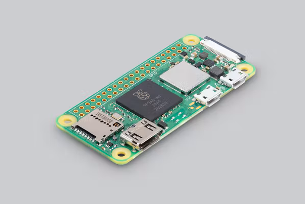
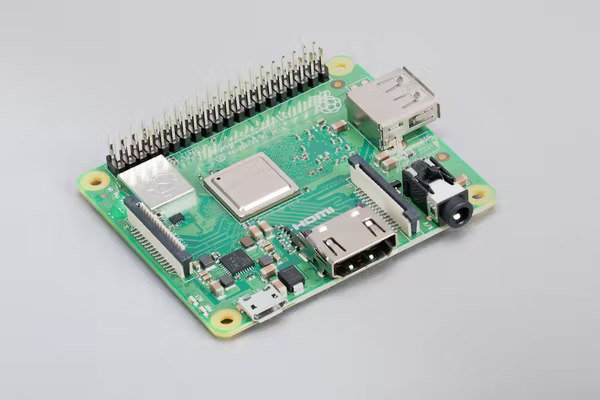
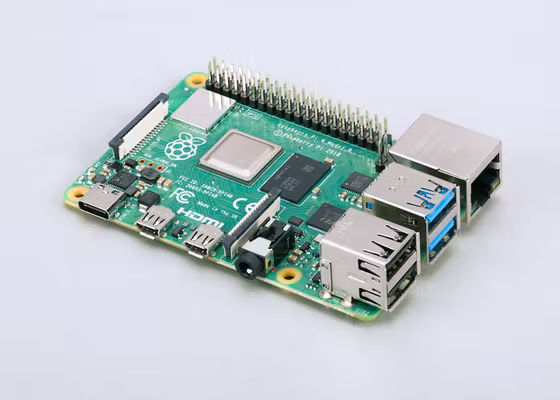
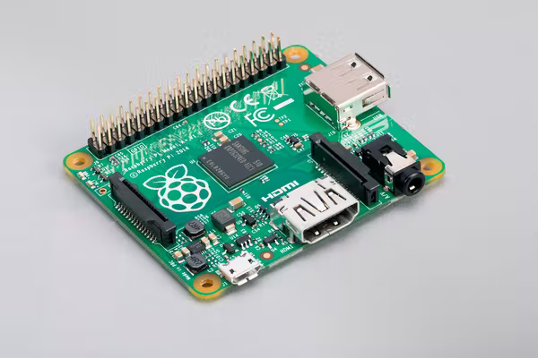

:::::::::::::::::::::::::::::::::::::: questions 

- What hardware do I need to set up CarpentriesOffline?
- What specifications should the hardware meet?

::::::::::::::::::::::::::::::::::::::::::::::::

::::::::::::::::::::::::::::::::::::: objectives

- Select an appropriate Raspberry Pi
- Select an appropriate SD card
- Understand alternative hardware

::::::::::::::::::::::::::::::::::::::::::::::::

## Introduction

This is a lesson created via The Carpentries Workbench. It is written in
[Pandoc-flavored Markdown](https://pandoc.org/MANUAL.txt) for static files and
[R Markdown][r-markdown] for dynamic files that can render code into output. 
Please refer to the [Introduction to The Carpentries 
Workbench](https://carpentries.github.io/sandpaper-docs/) for full documentation.

What you need to know is that there are three sections required for a valid
Carpentries lesson:

 1. `questions` are displayed at the beginning of the episode to prime the
    learner for the content.
 2. `objectives` are the learning objectives for an episode displayed with
    the questions.
 3. `keypoints` are displayed at the end of the episode to reinforce the
    objectives.

:::::::::::::::::::::::::::::::::::::::::::::::::::::::::::::::::::: instructor

Inline instructor notes can help inform instructors of timing challenges
associated with the lessons. They appear in the "Instructor View"

::::::::::::::::::::::::::::::::::::::::::::::::::::::::::::::::::::::::::::::::

||||
|---|---|---|
|a|b|c|d


<table>
 <tr>
  <td style="width: 50px">Raspberry Pi Zero</td>
  <td style="width: 50px">Raspberry Pi Zero W</td>
  <td style="width: 50px">Raspberry Pi Zero 2W</td>
 </tr>
 <tr>
  <td style="width: 50px">Raspberry Pi 3 model A+</td>
  <td style="width: 50px">Raspberry Pi 3 model B</td>
  <td style="width: 50px">Raspberry Pi 3 model B+</td>
 </tr>
 <tr>
  <td style="width: 50px">Raspberry Pi 4 model B</td>
  <td style="width: 50px">Raspberry Pi 400</td>
  <td style="width: 50px">Raspberry Pi pico</td>
 </tr>
 <tr>
  <td style="width: 50px">Raspberry Pi 1 model A+</td>
  <td style="width: 50px">Raspberry Pi 1 model B+</td>
  <td style="width: 50px"></td>
 </tr>
</table>

::::::::::::::::::::::::::::::::::::: challenge 

## Challenge 1: What are the different Raspberry Pis that are available?

:::::::::::::::::::::::: solution 

- Raspberry Pi zero
- Raspberry Pi zero W
- Raspberry Pi 1 model A+
- Raspberry Pi 1 model B+
- Raspberry Pi 3 model B
- Raspberry Pi 3 model B+
- Raspberry Pi 3 model A+
- Raspberry Pi 4 model B
- Raspberry Pi 400
- Raspberry Pi zero 2W
- Raspberry Pi pico

:::::::::::::::::::::::::::::::::


## Challenge 2: Which of the listed Raspberry Pis would be appropriate for this workshop?

- Raspberry Pi zero
- Raspberry Pi zero W
- Raspberry Pi 1 model A+
- Raspberry Pi 1 model B+
- Raspberry Pi 3 model B
- Raspberry Pi 3 model B+
- Raspberry Pi 3 model A+
- Raspberry Pi 4 model B
- Raspberry Pi 400
- Raspberry Pi zero 2W
- Raspberry Pi pico

:::::::::::::::::::::::: solution 

- Raspberry Pi 400
- Raspberry Pi 4 (all)
- Raspberry Pi 3 (all)
- Raspberry Pi zero (to be tested)

:::::::::::::::::::::::::::::::::


## Challenge 3: What is a Raspberry Pi? (MCQ, or text area)

1. A credit card sized computer
2. A delicious confectionary good
3. Computer only used for educational purposes
4. I don't know

:::::::::::::::::::::::: solution 

Correct Answer:
```
1. A credit card sized computer
```
Incorrect Answers:
```
2. A delicious confectionary good (This would be a raspberry pie)
3. Computer only used for educational purposes (Raspberry Pis can be used for many things aside from just education)
```
:::::::::::::::::::::::::::::::::


## Challenge 4: What is required to boot up a Raspberry Pi? (MCQ)

1. A micro SD card
2. A mini SD card
3. A monitor and keyboard/mouse
4. USB stick/flash-drive

:::::::::::::::::::::::: solution 

Correct Answer:
```
1. A micro SD card
```
Incorrect Answers:
```
2. A mini SD card (these are the wrong format, they won't fit in a Raspberry Pi)
3. A monitor and keyboard/mouse (a computer does not necessarily need any input devices to function)
4. USB stick/flash-drive (by default the Raspberry Pi will boot from the micro SD card, not the USB)
```
:::::::::::::::::::::::::::::::::
::::::::::::::::::::::::::::::::::::::::::::::::

## Figures

You can use standard markdown for static figures with the following syntax:

`{alt='alt text for
accessibility purposes'}`

{alt='Blue Carpentries hex person logo with no text.'}

## Math

One of our episodes contains $\LaTeX$ equations when describing how to create
dynamic reports with {knitr}, so we now use mathjax to describe this:

`$\alpha = \dfrac{1}{(1 - \beta)^2}$` becomes: $\alpha = \dfrac{1}{(1 - \beta)^2}$

Cool, right?

::::::::::::::::::::::::::::::::::::: keypoints 

- You need a suitable model of Raspberry Pi, or other computer capable of acting as a server
- You need a micro SD card (not to be confused with mini SD cards)
- Keyboards and monitors are not required for the Pi (can be run headless)

::::::::::::::::::::::::::::::::::::::::::::::::

[r-markdown]: https://rmarkdown.rstudio.com/
