:::::::::::::::::::::::::::::::::::::: questions 

- What is a raspberry Pi
- What hardware do I need to set up CarpentriesOffline?
- What specifications should the hardware meet?

::::::::::::::::::::::::::::::::::::::::::::::::

::::::::::::::::::::::::::::::::::::: objectives

- Select an appropriate Raspberry Pi
- Select an appropriate SD card
- Understand alternative hardware

::::::::::::::::::::::::::::::::::::::::::::::::

## Introduction

In order to hold an offline workshop we need some way of allowing the learners to download lesson material, data, and relevant software. To do this we need a computer with this data to act as an access point. Any computer which can run Linux with a web server will do, but for CarpentriesOffline we will be using the Raspberry Pi, due to its portability. Also, by sticking to only using Raspberry Pis we can ensure the software we use can be pre-packaged and will work without having to worry about getting the correct versions to work on differing hardware.

Raspberry Pis (not to be confused with Raspberry Pies) are low cost credit card sized computers often used in education. Their small size makes them very portable, allowing them to be set up and used anywhere with a power socket with minimal effort.

## Choosing a Raspberry Pi

A list of all the available Raspberry Pi devices can be found on the main Raspberry Pi website here: [https://www.raspberrypi.com/products/](https://www.raspberrypi.com/products/). Not all of these devices will work however, since some lack the minimum hardware requirements to run our software. The devices which will work are as follows:

- Raspberry Pi 400
- Raspberry Pi 4 (all)
- Raspberry Pi 3 (all)
- Raspberry Pi zero (to be tested)

Raspberry Pis below version 3 are simply too low spec to run the required software, so we must use versions 3+. It should also be noted that since the Raspberry Pi 3 uses a 32 bit operating system, it cannot run software which requires 64 bit (such as CodiMD and JupyterHub). Despite this, all the afformentioned Pis can still function as servers and access points without issue.

<table class="table">
 <tbody>
  <tr>
   <td>
    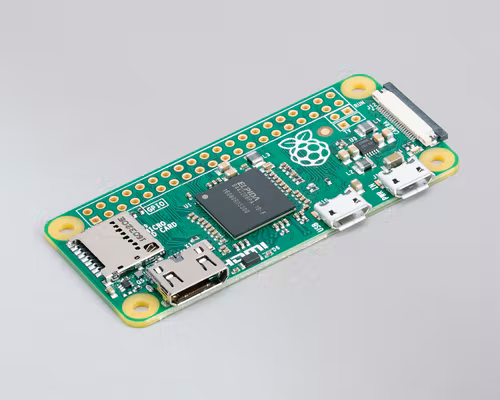
    Raspberry Pi Zero
   </td>
   <td>
    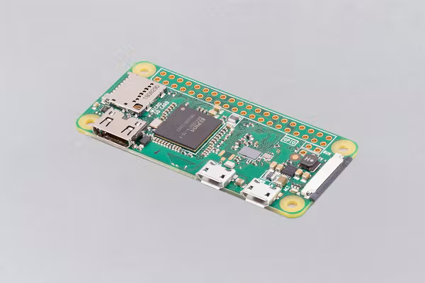
    Raspberry Pi Zero W
   </td>
   <td>
    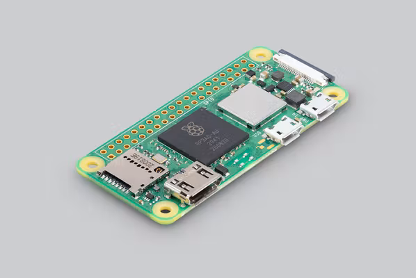
    Raspberry Pi Zero 2W
   </td>
  </tr>
  <tr>
   <td>
    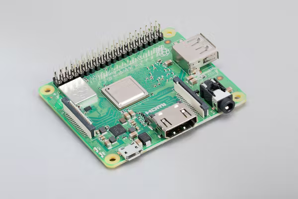
    Raspberry Pi 3 model A+
   </td>
   <td>
    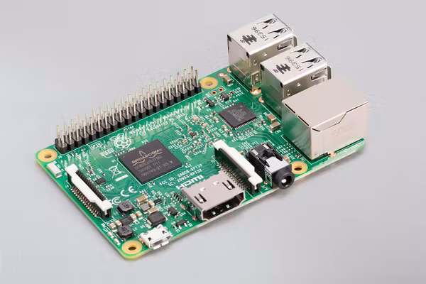
    Raspberry Pi 3 model B
   </td>
   <td>
    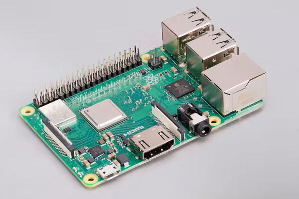
    Raspberry Pi 3 model B+
   </td>
  </tr>
  <tr>
   <td>
    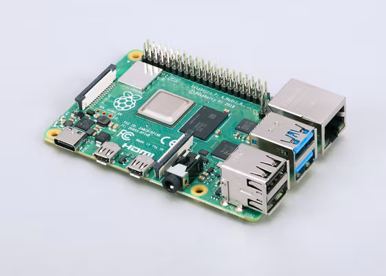
    Raspberry Pi 4 model B
   </td>
   <td>
    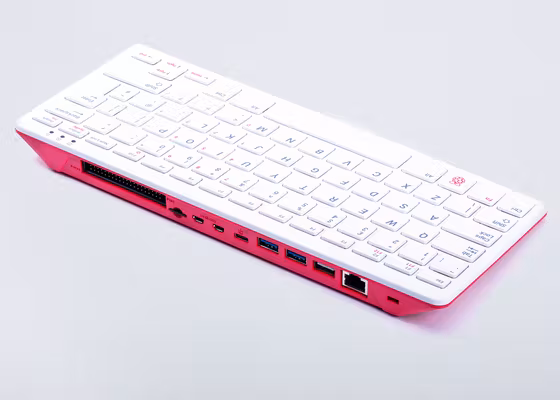
    Raspberry Pi 400
   </td>
   <td>
    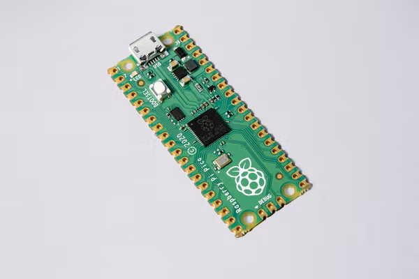
    Raspberry Pi pico
   </td>
  </tr>
  <tr>
   <td>
    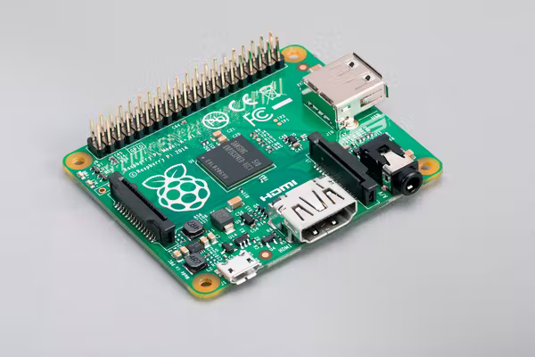
    Raspberry Pi 1 model A+
   </td>
   <td>
    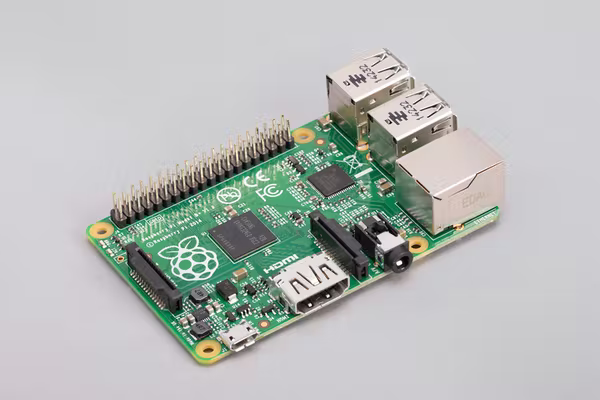
    Raspberry Pi 1 model B+
   </td>
   <td>
   </td>
  </tr>
 </tbody>
</table>

## Choosing an SD card

Just like any other computer, Raspberry Pis require a place to store data. Most Pis work with SD cards, of which there are multiple types. The specific type of SD card needed depends on which specific Raspberry Pi model you use (on the website you can see this for each model in the Specification section near the bottom of the page). The afformentioned Pis will use either a standard SD card, or a microSD card.

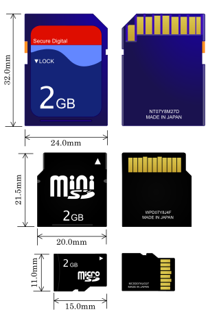

For CarpentriesOffline we need a minimum space of 5GB to store all of our software and data. Since SD cards come in sizes of incremental powers of two (2, 4, 8, 16, 32, etc.) we will need at minimum an 8GB SD card.

::::::::::::::::::::::::::::::::::::: challenge 

## Challenge 1: What are the different Raspberry Pis that are available?

A list of these can be found here: [https://www.raspberrypi.com/products/](https://www.raspberrypi.com/products/)

:::::::::::::::::::::::: solution 

- Raspberry Pi zero
- Raspberry Pi zero W
- Raspberry Pi zero 2W
- Raspberry Pi 1 model A+
- Raspberry Pi 1 model B+
- Raspberry Pi 3 model B
- Raspberry Pi 3 model B+
- Raspberry Pi 3 model A+
- Raspberry Pi 4 model B
- Raspberry Pi 400
- Raspberry Pi pico

:::::::::::::::::::::::::::::::::


## Challenge 2: Which of the listed Raspberry Pis would be appropriate for this workshop?

- Raspberry Pi zero
- Raspberry Pi zero W
- Raspberry Pi zero 2W
- Raspberry Pi 1 model A+
- Raspberry Pi 1 model B+
- Raspberry Pi 3 model B
- Raspberry Pi 3 model B+
- Raspberry Pi 3 model A+
- Raspberry Pi 4 model B
- Raspberry Pi 400
- Raspberry Pi pico

:::::::::::::::::::::::: solution 

- Raspberry Pi 400
- Raspberry Pi 4 (all)
- Raspberry Pi 3 (all)
- Raspberry Pi zero (to be tested)

:::::::::::::::::::::::::::::::::


## Challenge 3: What is a Raspberry Pi? (MCQ, or text area)

1. A credit card sized computer
2. A delicious confectionary good
3. Computer only used for educational purposes
4. I don't know

:::::::::::::::::::::::: solution 

Correct Answer:
```
1. A credit card sized computer
```
Incorrect Answers:
```
2. A delicious confectionary good (This would be a raspberry pie)
3. Computer only used for educational purposes (Raspberry Pis can be used for many things aside from just education)
```
:::::::::::::::::::::::::::::::::


## Challenge 4: What is required to boot up a Raspberry Pi? (MCQ)

1. A micro SD card
2. A mini SD card
3. A monitor and keyboard/mouse
4. USB stick/flash-drive

:::::::::::::::::::::::: solution 

Correct Answer:
```
1. A micro SD card
```
Incorrect Answers:
```
2. A mini SD card (these are the wrong format, they won't fit in a Raspberry Pi)
3. A monitor and keyboard/mouse (a computer does not necessarily need any input devices to function)
4. USB stick/flash-drive (by default the Raspberry Pi will boot from the micro SD card, not the USB)
```
:::::::::::::::::::::::::::::::::
::::::::::::::::::::::::::::::::::::::::::::::::

## Figures

You can use standard markdown for static figures with the following syntax:

`{alt='alt text for
accessibility purposes'}`

{alt='Blue Carpentries hex person logo with no text.'}

## Math

One of our episodes contains $\LaTeX$ equations when describing how to create
dynamic reports with {knitr}, so we now use mathjax to describe this:

`$\alpha = \dfrac{1}{(1 - \beta)^2}$` becomes: $\alpha = \dfrac{1}{(1 - \beta)^2}$

Cool, right?

::::::::::::::::::::::::::::::::::::: keypoints 

- You need a suitable model of Raspberry Pi, or other computer capable of acting as a server
- You need a micro SD card (not to be confused with mini SD cards)
- Keyboards and monitors are not required for the Pi (can be run headless)

::::::::::::::::::::::::::::::::::::::::::::::::

[r-markdown]: https://rmarkdown.rstudio.com/
