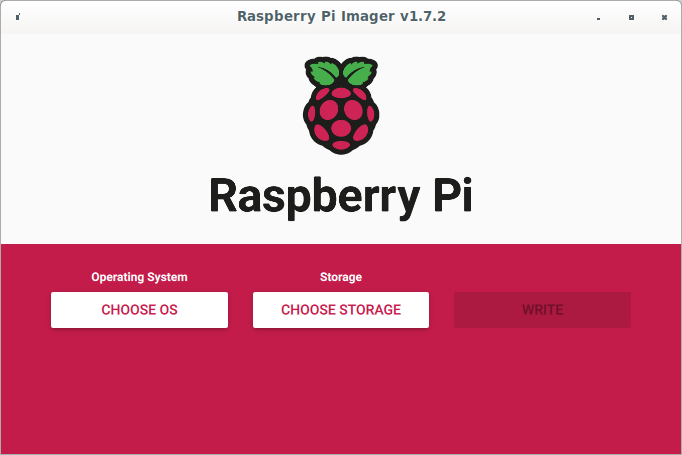
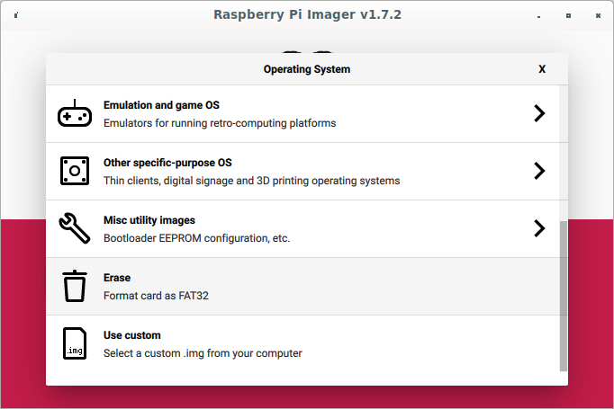
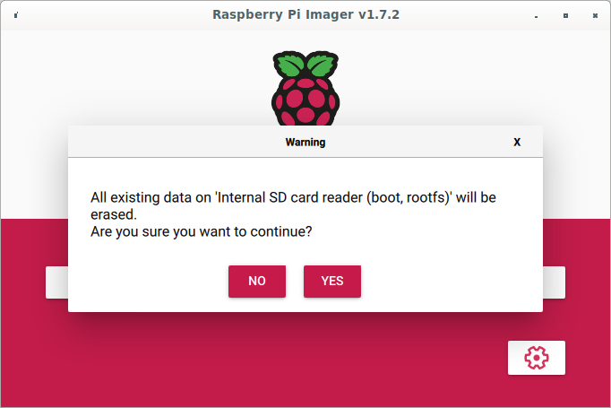
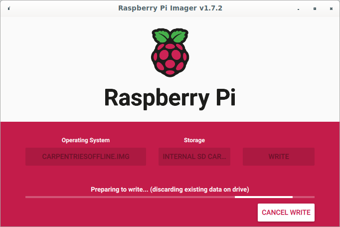
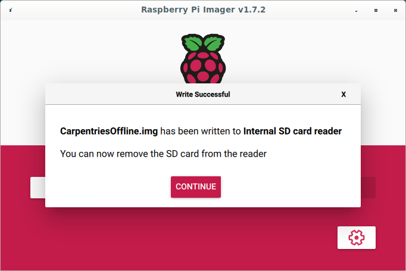

:::::::::::::::::::::::::::::::::::::: questions 

- Where do you download the Raspberry Pi imager from?
- How do you install the Raspberry Pi imager on your computer?
- 

::::::::::::::::::::::::::::::::::::::::::::::::

::::::::::::::::::::::::::::::::::::: objectives

- download and install the Raspberry Pi imager
- download and install the CarpentriesOffline image
- write the CarpentriesOffline image to the SD Card

::::::::::::::::::::::::::::::::::::::::::::::::

## Introduction

Every computer needs to load an operating system when you switch it on. Therefore it will usually have a default place where it will look for an operating system in the first place. The process of loading the operating system is called **booting**. In general, if someone tells you to reboot your computer it means to switch is off and switch it back on again so that the operating system can be loaded from scratch. In the case of your desktop or laptop computers you will have a hard drive built into the computer or alternatively you might be able to boot from a USB device.

In the case of the Raspberry Pi its default booting device is an SD card. Pre-RPi3 used a mini-SD card but RPi3 and RPi4 use micro-SD cards. SD cards are available in various capacities, ie. the amount of information that can be stored on it. A basic operating system for the Pi will probably take about 2GB but then you will also need space for all the Carpentries lesson files and other software that you want to make available to the learners. 

Usually when you buy a RPi you can also buy an SD card with the operating system pre-loaded. Alternatively you can buy an empty SD card and prepare it yourself. Preparing the SD card involves downloading an **image** of the operating system (and there are various versions available), downloading the software, Raspberry Pi Imager, required for writing the image to the SD card and then using the software to write the image to the SD card.

The CarpentriesOffline team is building an **image** that can be written to the SD card that contains the operating system and all the required files. This image is about 5GB at the moment. So you will need an SD card that can hold at least that. The image is hosted on the CarpentriesOffline website and will be called CarpentriesOffline_vX.XX.img where X.XX is the version of the image. It might take a while to download this image so your instructor might choose to make the image available locally for this lesson, eg. on a USB memory stick. However, if you are going to download it, using your browser, make your way to [https://github.com/carpentriesoffline/CarpentriesOffline.github.io](https://github.com/carpentriesoffline/CarpentriesOffline.github.io). On the right hand side of the page, there should be a section with the heading **Releases**. Click on the release you wish to download and save the file to your computer.

::: challenge 

## Challenge 1: What software do you need to prepare an SD card?

1. Word
2. Excel
3. Raspberry Pi Imager
4. LibreOffice
5. SonicPi

:::::: solution

1. Word cannot be used to prepare an SD card, it is a word processor
3. Excel cannot be used to prepare an SD card, it is a spreadsheet
4. The correct answer is *3*
5. LibreOffice is an office suite and connot be used to prepare an SD card
6. SonicPi is a live coding environment to support computing and music lessons in schools.

::::::

:::

::: challenge

## Challenge 2: Where would you find the CarpentriesOffline image?

1. On the Raspberry Pi website
2. On The Carpentries website
3. On the CarpentriesOffline website
4. On the Microsoft website?

:::::: solution

::::::

:::

If you have not already done so you have to download and install the Raspberry Pi Imager. Using your browser, navigate to the Raspberry Pi [download page](https://www.raspberrypi.com/software/). You should now be able to select the download for your operating system. Click on the approprate link and save the installation file to your computer. The web page will provide further information for installing the software on your computer.

Once the installation is complete you should be able to run the imager which will open with the following screen:

{alt='An image of the Raspberry Pi Imager software intro screen'}

You can now click on the **Choose OS** button which will open a window for selecting the image you want to write to the SD card. Scroll down to the bottom where you should find an option **Use custom**. Click on that option:

{alt='An image of the RPi Imager software screen for selecting an image to be written to the SD card'}

Navigate to where you saved the CarpentriesOffline image and select it. Make sure you have inserted the SD card into your computer. Now click on the **Choose Storage** button and select the device you want to write the image to:

{alt='An image of the RPi Imager software screen for selecting the device to be written to'}

Once you have selected the Storage device, click the **WRITE** button. You will be prompted to overwrite the information on the SD card, click on **YES** to accept.

{alt='An image of the RPi Imager software screen for confirming to overwrite the SD card'}

The image will now be written to the SD card.

{alt='An image of the RPi Imager software screen while writing the image to the SD card'}

Once the image has been written to the SD card a **Write Successful** message will be displayed.

{alt='An image of the RPi Imager software screen after the image has been written succesfully.'}

You can now remove the SD card from your computer and insert it into the Raspberry Pi.

::::::::::::::::::::::::::::::::::::: keypoints 

- Know where to download the Raspberry Pi Imager from
- Know how to install the Raspberry Pi Imager
- Know where to download the CarpentriesOffline RPi image
- Know how to write the CarpentriesOffline image to an SD card

::::::::::::::::::::::::::::::::::::::::::::::::

[r-markdown]: https://rmarkdown.rstudio.com/
